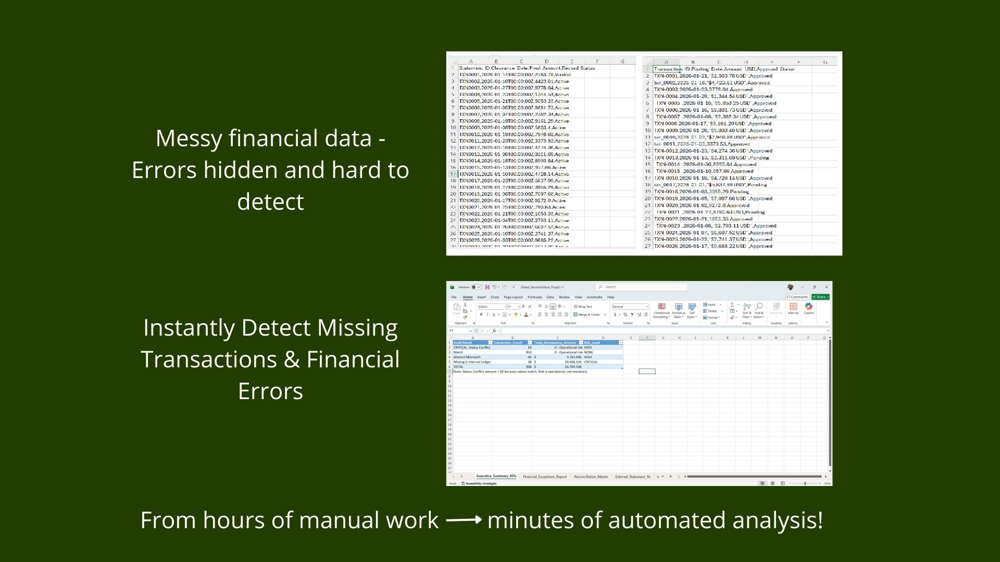
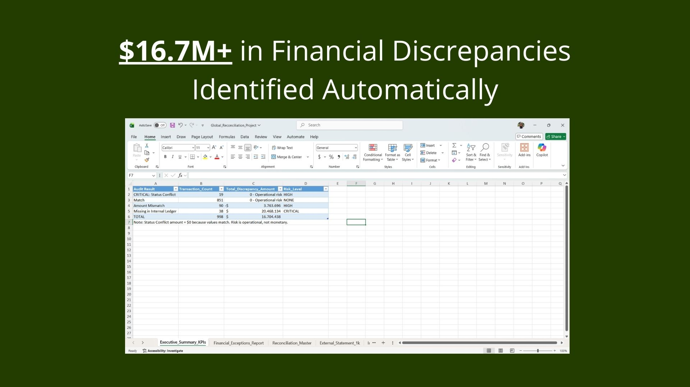
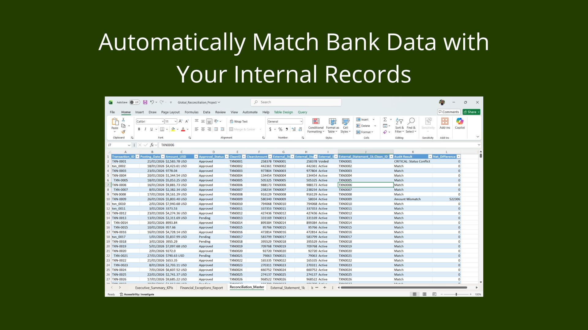
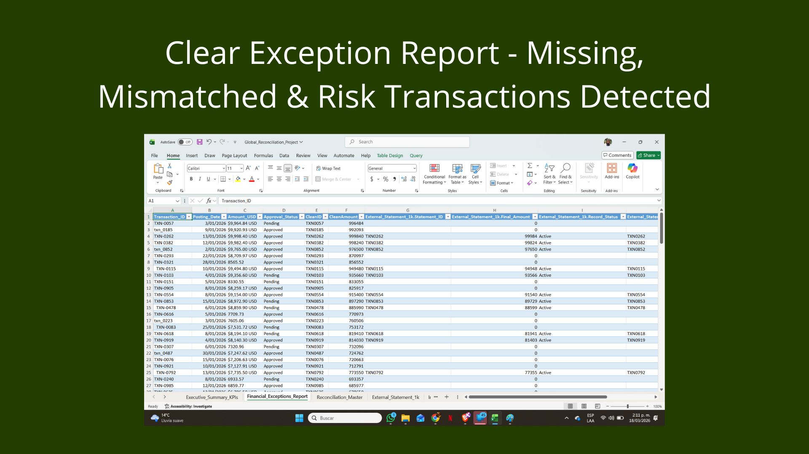
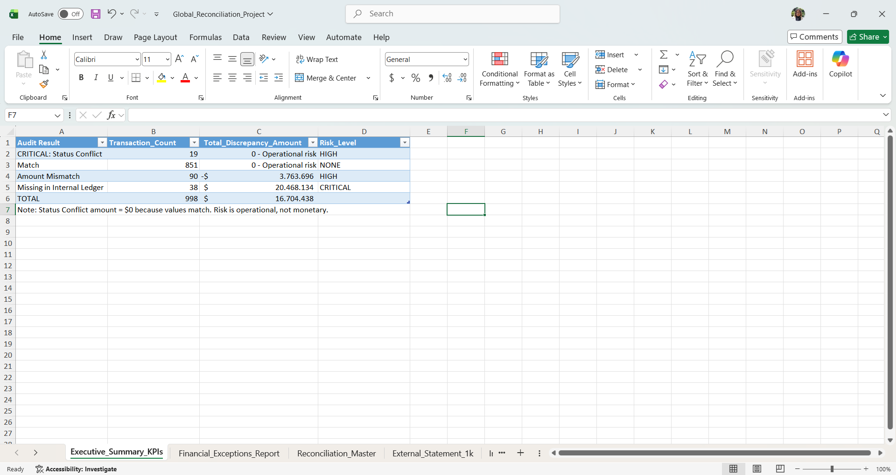
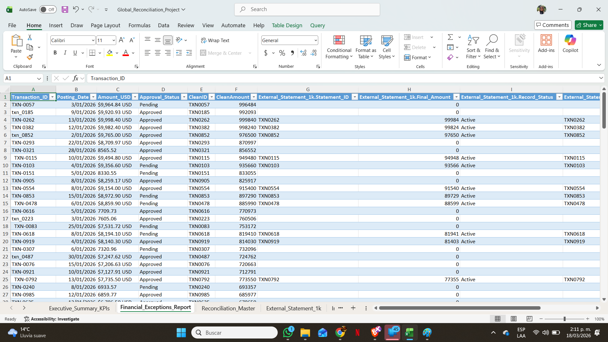
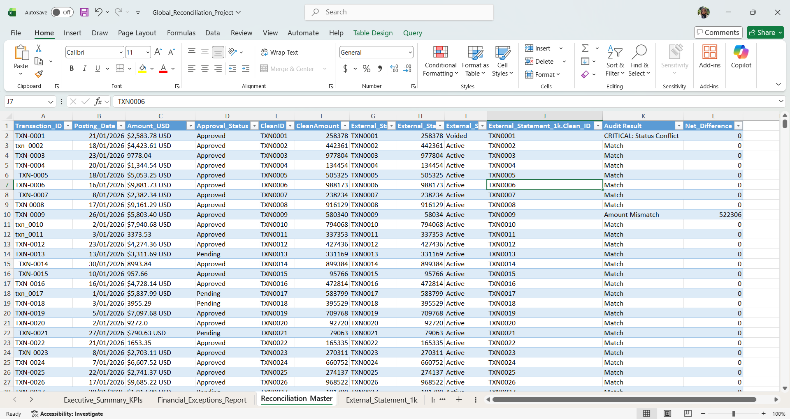

# Financial Reconciliation & Exception Report System

**Excel · Power Query (M) · ETL Architecture**

---

---

## Overview

This project automates the reconciliation of financial records between 
an **internal ledger** and an **external bank statement**, helping 
finance teams identify discrepancies, missing transactions, and 
operational risks quickly and accurately.

Built in **Excel + Power Query**, the solution handles high-volume data, 
standardizes inconsistent transaction formats, and produces a fully 
traceable exception report for audit and review.

No manual matching. No hidden logic. Every discrepancy is documented 
and traceable.

---

## Results at a Glance

| Audit Result | Transactions | Discrepancy Amount |
|---|---:|---:|
| ✅ Match | 851 | $0 |
| ⚠️ Amount Mismatch | 90 | -$3,763,696 |
| 🔴 Missing in Internal Ledger | 38 | $20,468,134 |
| 🚨 CRITICAL: Status Conflict | 19 | Operational Risk |
| **TOTAL** | **998** | **$16,704,438 identified** |

### Business Impact
- Reduced reconciliation time from **hours to minutes**
- Identified **$16.7M+ in financial discrepancies**
- Delivered full audit visibility over financial inconsistencies
- Improved traceability and exception management across the workflow

---

## The Problem

Manual reconciliation in high-volume financial environments fails because of:

- **Data Friction:** Transaction IDs entered inconsistently across systems
  (`TXN-001`, `txn_001`, `TXN001`)
- **Format Conflicts:** Amounts stored as strings instead of numeric values
  (`$2,500.00 USD` vs `2500`)
- **Audit Gaps:** No systematic way to identify records missing on one side
- **Status Mismatches:** Records approved internally but voided externally

A simulated mid-sized fintech company was processing over **1,000 monthly 
transactions** across two systems with no reliable way to detect which 
transactions matched, which were missing, and which represented critical risks.

---

## The Solution

A **3-layer ETL reconciliation architecture** in Excel and Power Query that:

- Cleans and standardizes transaction identifiers
- Converts mixed currency formats into numeric values
- Reconciles records across both sources using Full Outer Join + Anti-Joins
- Classifies each transaction into audit-ready exception categories
- Generates a clear, actionable exception report for immediate review

---

## System Preview

### Automated Bank Matching — Reconciliation Master

### Exception Report — Missing, Mismatched & Risk Transactions Detected

---

## Technical Architecture

### Layer 1 — Staging
Raw source ingestion from:
- Internal Ledger (`Internal_Ledger_1k`)
- External Bank Statement (`External_Statement_1k`)

### Layer 2 — Transformation

**Transaction ID Normalization**
Custom Power Query function (`fnNormalizeID`) standardizes 
alphanumeric identifiers:
- `Text.Upper` · `Text.Trim` · `Text.Select`
- `" txn_001 "` → `"TXN001"`

**Currency & Numeric Parsing**
Complex currency strings converted into fixed decimal values:
- `"$2,500.00 USD"` → `2500.00`

### Layer 3 — Load / Reporting
Transformed data loaded into reconciliation and reporting outputs 
for audit review.

---

## Reconciliation Logic

### Matching Logic
- **Full Outer Join** — Creates master reconciliation view
- **Anti-Joins** — Isolates unmatched records on either side

### Exception Categories

| Category | Description | Risk Level |
|---|---|---|
| Match | Exists in both sources, values agree | NONE |
| Amount Mismatch | Exists in both, values differ | HIGH |
| Missing in Internal Ledger | Present externally, absent internally | CRITICAL |
| Missing in External Statement | Present internally, absent externally | HIGH |
| Status Conflict | Internal status conflicts with external status (e.g. Approved vs Voided) | HIGH |

---

## Screenshots

### Executive Summary KPIs

### Financial Exceptions Report

### Reconciliation Master

---

## File Structure

| Sheet | Description |
|---|---|
| `Executive_Summary_KPIs` | High-level audit metrics and risk classification |
| `Reconciliation_Master` | Full cross-validated transaction table |
| `Financial_Exceptions_Report` | Filtered view of exception records requiring action |
| `Internal_Ledger_1k` | Raw internal source data |
| `External_Statement_1k` | Raw external source data |

---

## Tech Stack

| Tool | Purpose |
|---|---|
| **Excel** | Reporting layer and user-facing structure |
| **Power Query (M)** | ETL logic, normalization, joins, data transformation |
| **DAX** | KPI calculations and audit flag logic |

---

## Key Design Principles

- **Full traceability** — From raw source to final exception report
- **No hidden transformations** — Every rule is documented and explainable
- **Actionable outputs** — Designed for finance and audit teams, not analysts
- **Reusable structure** — Modular query design for similar reconciliation workflows
- **Maintainable logic** — Parameter tables for non-technical users

---

## Use Cases

This solution can be adapted for:
- Bank vs. ledger reconciliation
- ERP vs. payment processor validation
- Internal finance audits
- Exception reporting workflows
- Transaction integrity checks in fintech or accounting environments

---

## Author

**Diana Novoa**
Data Analyst · Excel · Power Query · SQL · Financial Reconciliation Systems
[LinkedIn](https://linkedin.com/in/diana-novoa-624546219) · 
[GitHub](https://github.com/Diannov402)

---

> **⚠️ Data Disclaimer:** The dataset used in this project was 
> synthetically generated for portfolio purposes using AI-simulated 
> financial data. All ETL logic, Power Query architecture, 
> reconciliation rules, exception classification, and reporting 
> design were independently developed.
